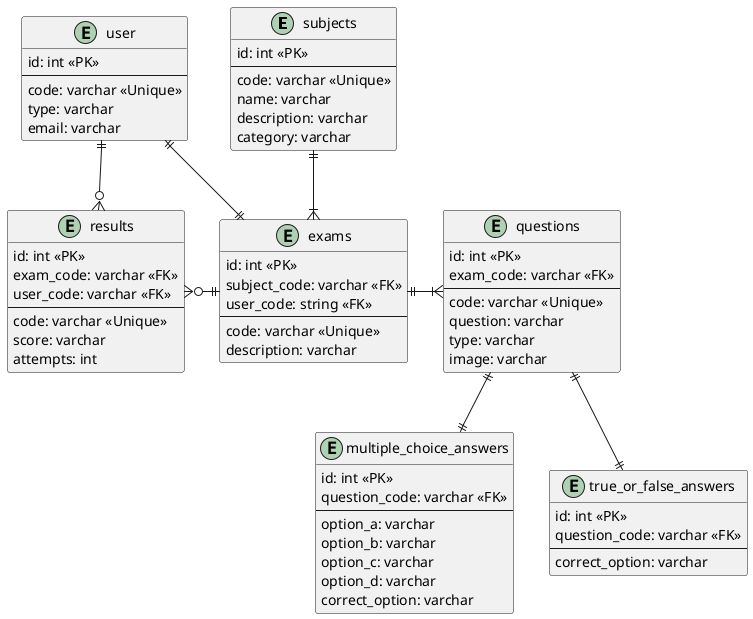

```plantuml
@startuml
entity subjects {
  id: int <<PK>>
  --
  code: varchar <<Unique>>
  name: varchar 
  description: varchar 
  category: varchar 
}

entity questions {
  id: int <<PK>>
  exam_code: varchar <<FK>>
  --
  code: varchar <<Unique>>
  question: varchar
  type: varchar
  image: varchar
}

entity "multiple_choice_answers" as m_answers {
  id: int <<PK>>
  question_code: varchar <<FK>>
  --
  option_a: varchar
  option_b: varchar
  option_c: varchar
  option_d: varchar
  correct_option: varchar
} 

entity "true_or_false_answers" as b_answers {
  id: int <<PK>>
  question_code: varchar <<FK>>
  --
  correct_option: varchar
}

entity exams {
  id: int <<PK>>
  subject_code: varchar <<FK>>
  user_code: string <<FK>>
  --
  code: varchar <<Unique>>
  description: varchar
}

entity results {
  id: int <<PK>>
  exam_code: varchar <<FK>>
  user_code: varchar <<FK>>
  --
  code: varchar <<Unique>>
  score: varchar
  attempts: int
}

entity user {
  id: int <<PK>>
  --
  code: varchar <<Unique>>
  type: varchar
  email: varchar
}

user ||--|| exams
exams }|-up-|| subjects
exams ||-right-|{ questions
questions ||--|| m_answers
questions ||--|| b_answers
results }o-up-|| user
results }o-|| exams
@enduml
```