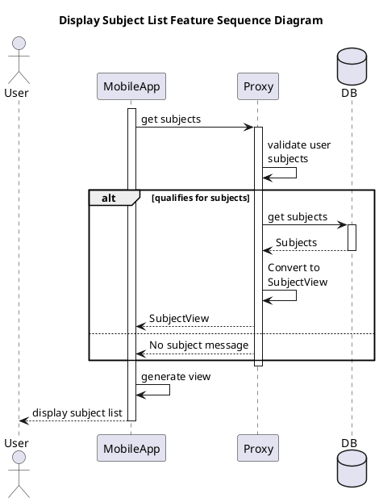

```plantuml
@startuml
title Display Subject List Feature Sequence Diagram

actor User
participant MobileApp
participant "Proxy" as proxy
database "DB" as db

activate MobileApp
    MobileApp -> proxy: get subjects
        activate proxy
            proxy -> proxy: validate user \nsubjects
            alt qualifies for subjects
                proxy -> db: get subjects      
                activate db
                    db --> proxy: Subjects
                deactivate db 
                proxy -> proxy: Convert to \nSubjectView
                proxy --> MobileApp: SubjectView
            else
                proxy --> MobileApp: No subject message
            end alt
            
        deactivate proxy 
    MobileApp -> MobileApp: generate view
    MobileApp --> User: display subject list
deactivate MobileApp

@enduml
```