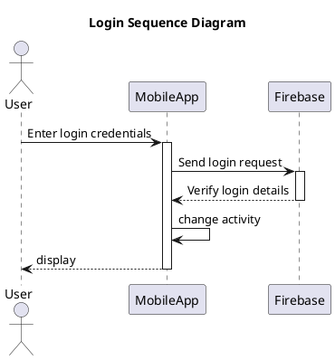

```plantuml
@startuml
title Login Sequence Diagram

actor User
participant MobileApp
participant Firebase

User -> MobileApp: Enter login credentials
activate MobileApp
    MobileApp -> Firebase: Send login request
        activate Firebase
            Firebase --> MobileApp: Verify login details
        deactivate Firebase    
    MobileApp -> MobileApp: change activity
    MobileApp --> User: display
deactivate MobileApp
@enduml
```