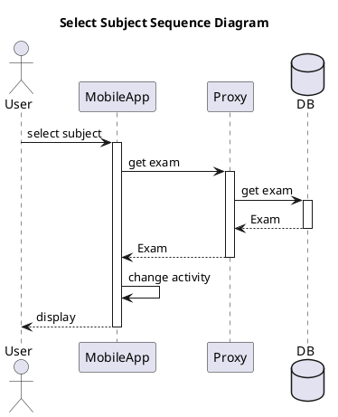

```plantuml
@startuml
title Select Subject Sequence Diagram

actor User
participant MobileApp
participant "Proxy" as proxy
database "DB" as db

User -> MobileApp: select subject 
activate MobileApp
    MobileApp -> proxy: get exam
        activate proxy
            proxy -> db: get exam
            activate db
                db --> proxy: Exam
            deactivate db         
            proxy --> MobileApp: Exam
        deactivate proxy    
    MobileApp -> MobileApp: change activity
    MobileApp --> User: display
deactivate MobileApp
@enduml
```