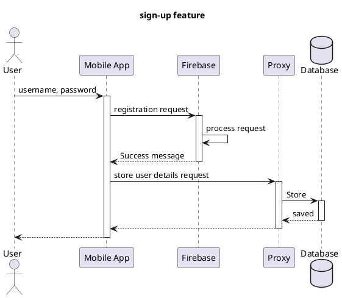

```plantuml
@startuml
title sign-up feature
actor User
participant "Mobile App" as funzo
participant Firebase
participant Proxy as proxy
database "Database" as db

User-> funzo: username, password
activate funzo
    funzo -> Firebase: registration request
    activate Firebase
        Firebase -> Firebase: process request
        Firebase --> funzo: Success message
    deactivate Firebase
    funzo -> proxy: store user details request
    activate proxy
        proxy -> db: Store
        activate db
            db --> proxy: saved
        deactivate db
        proxy --> funzo:
    deactivate proxy
    User<-- funzo:
deactivate funzo
@enduml
```