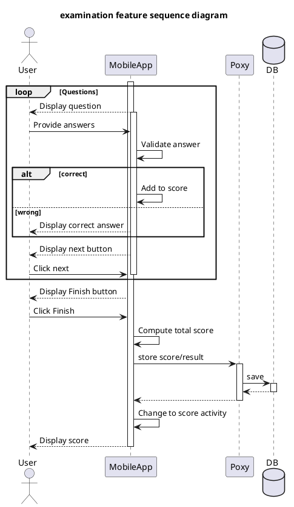

```plantuml
@startuml
title examination feature sequence diagram
actor "User" as user
participant "MobileApp" as mobile
participant "Poxy" as proxy
database "DB" as db
activate mobile
    loop Questions
        user <-- mobile: Display question
        activate mobile
            user -> mobile: Provide answers
            mobile -> mobile: Validate answer 
            alt correct
                mobile -> mobile: Add to score
            else wrong
                mobile --> user: Display correct answer
            end alt
            mobile --> user: Display next button
            user -> mobile: Click next
        deactivate mobile
    end loop
    mobile --> user: Display Finish button
    user -> mobile: Click Finish
    mobile -> mobile: Compute total score
    mobile -> proxy: store score/result
    activate proxy
        proxy -> db: save
        activate db
            db --> proxy: 
        deactivate db
        proxy --> mobile
    deactivate proxy
    mobile -> mobile: Change to score activity
    mobile --> user: Display score
deactivate mobile
@enduml
```