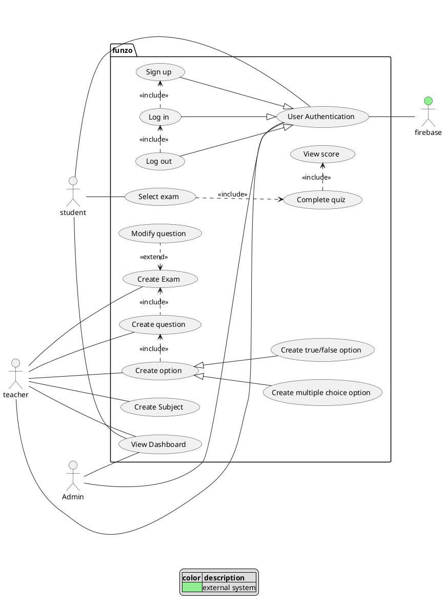

```plantuml
@startuml
actor student
actor "teacher" as lecturer
actor firebase #lightGreen
actor "Admin" as admin 

package funzo {
  usecase "Select exam" as subject
  usecase "Complete quiz" as quiz
  usecase "View score" as results
  usecase "Create Exam" as createExam
  usecase "Create Subject" as createSubject
  usecase "Create question" as createQ
  usecase "Log out" as logOut
  usecase "Log in" as logIn
  usecase "Sign up" as signUp
  usecase "Modify question" as modifyQ
  usecase "Create option" as createO
  usecase "Create multiple choice option" as mcq
  usecase "Create true/false option" as tf
  usecase "User Authentication" as auth
  usecase "View Dashboard" as dashboard
}

left to right direction
admin -- dashboard
admin -- auth
student -- dashboard
student -- auth
student -- subject
subject ..> quiz: <<include>>
quiz .> results: <<include>>
lecturer --- dashboard
lecturer -- auth
lecturer -- createExam
lecturer -- createSubject
lecturer -- createO
lecturer -- createQ
firebase -up- auth
logOut .right.> logIn: <<include>>
logIn .right.> signUp: <<include>>
createExam <.right. modifyQ: <<extend>>
createExam <.right. createQ: <<include>>
createO .> createQ : <<include>>

auth <|-up- logIn
auth <|-up- signUp
auth <|-up- logOut
createO <|-- mcq
createO <|-- tf

legend 
|**color** | **description**|
|<#lightgreen>|external system|
end legend

@enduml
```