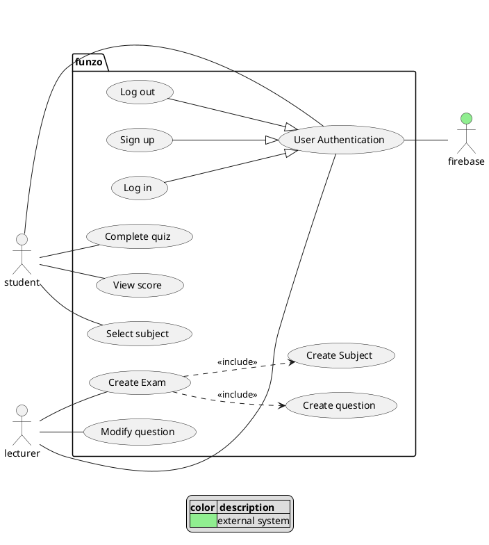

```plantuml
@startuml
actor student
actor lecturer
actor firebase #lightgreen

package funzo {
  usecase "Select subject" as subject
  usecase "Complete quiz" as quiz
  usecase "View score" as results
  usecase "Log out" as logOut
  usecase "Log in" as logIn
  usecase "Sign up" as signUp
  usecase "Create Exam" as createExam
  usecase "Create Subject" as createSubject
  usecase "Create question" as createQ
  usecase "Modify question" as modifyQ
  usecase "User Authentication" as auth
}

left to right direction
student -- auth
student -- subject
student -- quiz
student -- results
lecturer -- auth
lecturer -- createExam
createExam ..> createQ: <<include>>
createExam ..> createSubject: <<include>>
lecturer -- modifyQ
firebase -up- auth


top to bottom direction
auth <|-up- logIn
auth <|-up- signUp
auth <|-up- logOut

left to right direction

legend 
|**color** | **description**|
|<#lightgreen>|external system|
end legend

@enduml
```